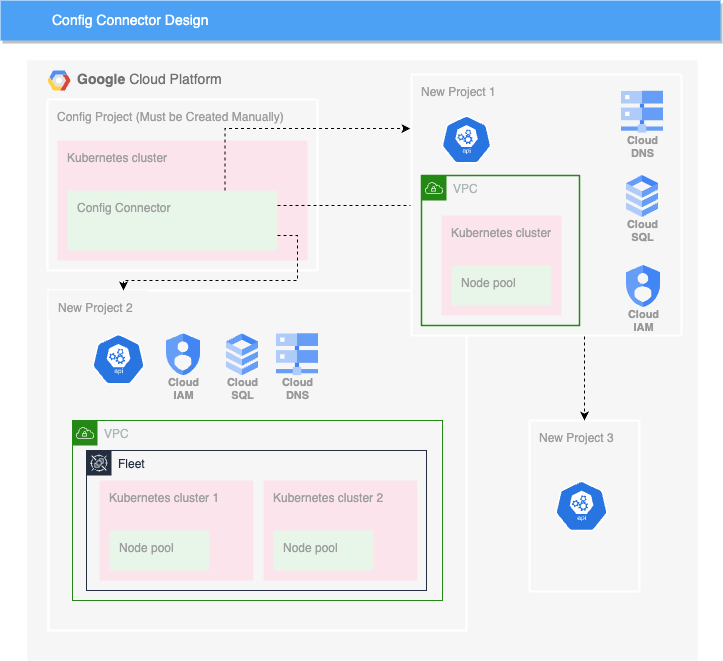

# Config Connector Chart

This chart was created to help you deploy Google Cloud Projects and Infrastructure using GCP's [Config Connector](https://cloud.google.com/config-connector/docs/overview) addon.

# Intent

The chart allows you to deploy the majority of your infrastructure using a Infrastructure as Code (IaC) methodology. This allows you to use your CI\CD solution(s) to deploy Infrastructure (E.G. ArgoCD).

# Information

This chart evolved from what was needed in specific use cases for an Organization. This means that the chart does not represent all resources or resource options that can be deployed using config connector. PR's and Issues are welcome!

# Prerequisites

The methodology for this charts use is that you have an existing Kubernetes cluster running Config Connector, or have a working instance of Config Connector that can be used to deploy everything from. This source Config Connector instance's Service account must have "Project Creator" IAM permissions on the GCP Organization where all of your Projects and resources will be deployed under. This will allow you to use your source Config Connector instance \ cluster to then deploy GCP projects and resources \ Infrastructure from.

NOTE: This chart includes the option to include secrets using the [external-secrets operator](https://external-secrets.io/latest/). If you want to use this, you must ensure the operator is installed and configured correctly.

# Design

</br>

# Currently supported resources

- Projects
- API's
- VPC Networks
- VPC Network Peering
- Firewall Rules
- Shared VPC (Host and Service Projects)
- Kubernetes Clusters
- Kubernetes Node Pools
- IAM Service Accounts
- IAM Policies
- Compute Addresses
- Service Networking Connections
- Cloud DNS
- gkeHub (Fleet)
- SSL Policies
- Cloud Monitoring
- Cloud SQL
- Logging Buckets
- Security Policies
- Cloud IDS
- Cloud VPN (Compute Router, VPN Gateway, External VPN Gateway, VPN Tunnel)

# Usage

```console
$ helm repo add pursechicken https://pursechicken.github.io/helm-charts
```

Use the chart as a dependency to your own chart.

```Chart.yaml
dependencies:
- name: cnrm-chart
  version: "1.2.9"
  repository: "https://pursechicken.github.io/helm-charts"
```

Then pull the dependency chart down

```console
$ helm dep update
```

Specify the values you want to use in your own values file. Use the included values.yaml file as a reference. Lots of comments are included in the values file.

[values.yaml](./values.yaml)

# Caveats

- Not all Config Connector options and resources are available yet in the chart. They will be added as needed or if possible when requested.
- The chart assumes that you are deploying projects and resources external to the current project its running in.
- For safety reasons, a lot of the resources are deployed use the "abandon" deletion-policy annotation. This means that the majority of your resources will need to be manually deleted if you delete them from Config Connector. **There is now an option to configure this.
- The chart has only been tested using config connector in an existing k8s cluster in GCP running with a Workload Identity binding to a service account. Its possible this may also work if you are running config connector outside of k8s or in another way. What's likely more important is that the instance account has the proper permissions.